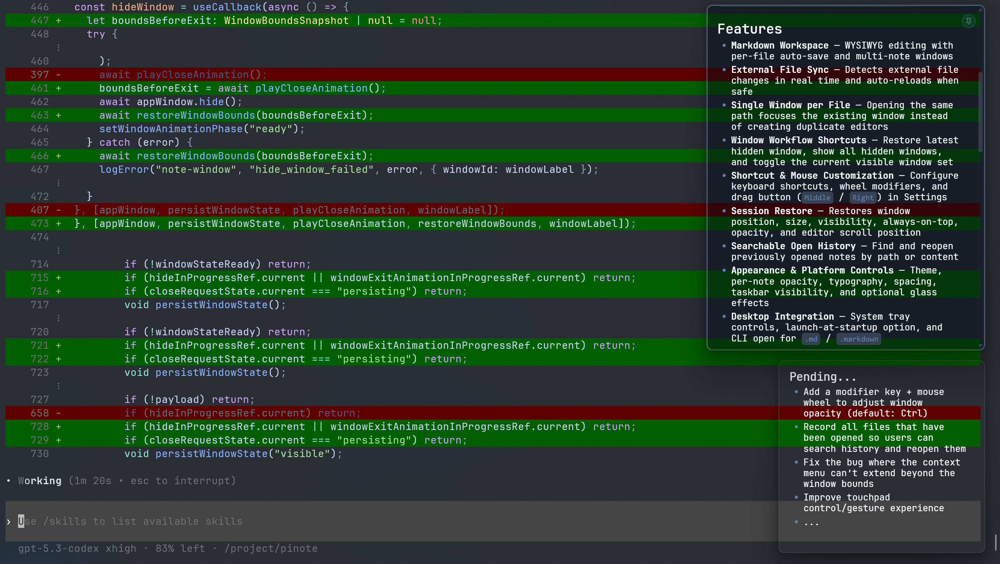

# Pinote

A lightweight floating markdown scratchpad app for your desktop. Pinote stays on top of your workflow, providing a quick-access area to jot down notes, TODOs, code snippets, and ideas — without breaking your focus.



## Features

- **Markdown Workspace** — WYSIWYG editing with per-file auto-save and multi-note windows
- **External File Sync** — Detects external file changes in real time and auto-reloads when safe
- **Single Window per File** — Opening the same path focuses the existing window instead of creating duplicate editors
- **Window Workflow Shortcuts** — Restore latest hidden window, show all hidden windows, and toggle the current visible window set with relaunch-safe snapshot recovery
- **Read-Only Mode** — Toggle per-note read-only mode via shortcut or context menu, with dedicated visual state
- **Shortcut & Mouse Customization** — Configure keyboard shortcuts, wheel modifiers, and drag button (`Middle` / `Right`) in Settings
- **Session Restore** — Restores window position, size, visibility, always-on-top, read-only, opacity, editor scroll position, and the last toggled visible-window set
- **Searchable Open History** — Find and reopen previously opened notes by path or content
- **Appearance & Platform Controls** — Theme, per-note opacity, typography, spacing, taskbar visibility, and optional glass effects
- **Desktop Integration** — System tray controls, launch-at-startup option, and CLI open for `.md` / `.markdown`

## Keyboard Shortcuts

| Default Shortcut | Action                 |
| ---------------- | ---------------------- |
| `Alt+S`          | Restore hidden window  |
| `Alt+Shift+H`    | Show all hidden windows |
| `Alt+D`          | Toggle visible windows |
| `Alt+C`          | New note               |
| `Alt+A`          | Toggle always on top   |
| `Alt+R`          | Toggle read-only mode  |
| `Ctrl+Shift+D`   | Toggle dark mode       |
| `Esc`            | Hide window            |
| `Ctrl+Shift+W`   | Close window           |

Shortcuts can be changed in the Settings window.

## Mouse Interactions

| Default Interaction | Action                                |
| ------------------- | ------------------------------------- |
| `Alt+Wheel`         | Resize window around cursor           |
| `Middle Click`      | Toggle always on top                  |
| `Middle Drag`       | Move window (default, configurable)   |
| `Right Click`       | Open context menu with common actions |

`Alt+Wheel` modifier can be changed to `Ctrl`, `Shift`, or `Meta` in Settings. Drag button can be changed to `Middle` or `Right`.

## Development

```bash
pnpm install          # Install dependencies
pnpm tauri dev        # Run in development mode
pnpm tauri build      # Build for production
```

## Automation

- GitHub Actions includes a `Dependency Update` workflow that runs daily at `04:00 UTC` and can also be started manually.
- It refreshes `pnpm-lock.yaml` and `src-tauri/Cargo.lock`, runs lint, typecheck, and Rust tests, then pushes the result directly to `main`.
- Configure the repository secret `AUTO_UPDATE_TOKEN` with a token that can push to `main` and bypass branch protection if your rules require it.
- Use a fine-grained PAT with repository `Contents: Read and write` and `Actions: Read` permissions so the pushed commit can trigger follow-up workflows normally.

## CLI

```bash
pinote /path/to/note.md
pinote ./daily.markdown
```

Each path opens a dedicated note window. Running the command again with the same path focuses the existing window.
